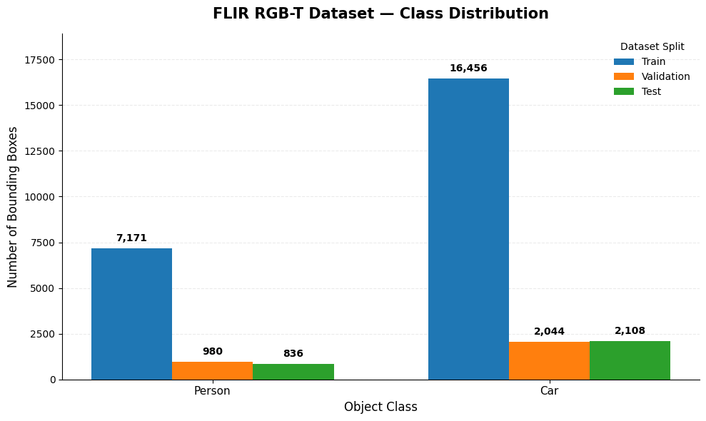
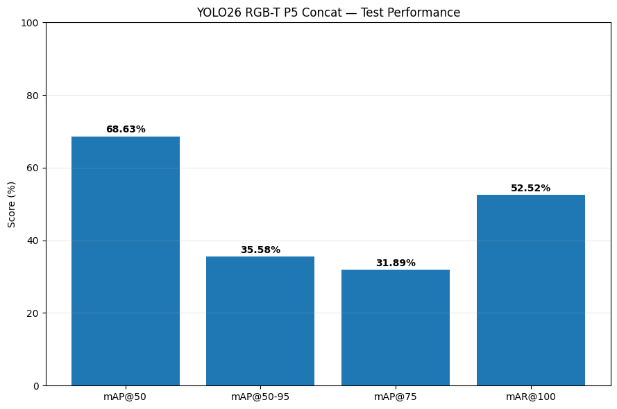
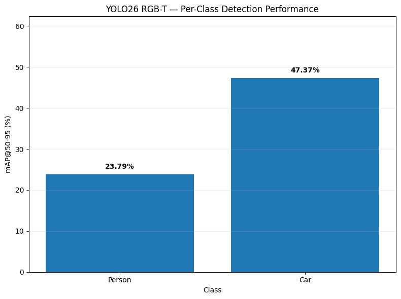
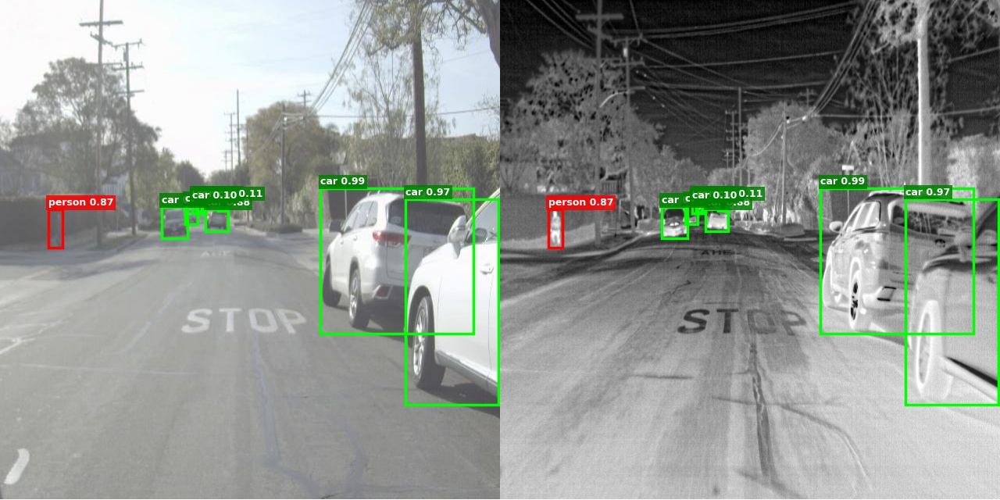
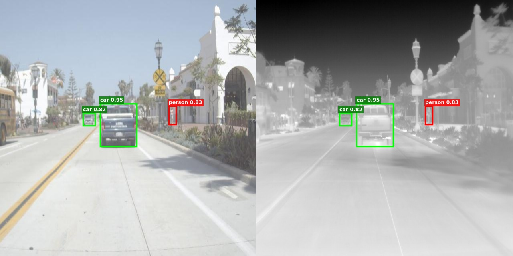
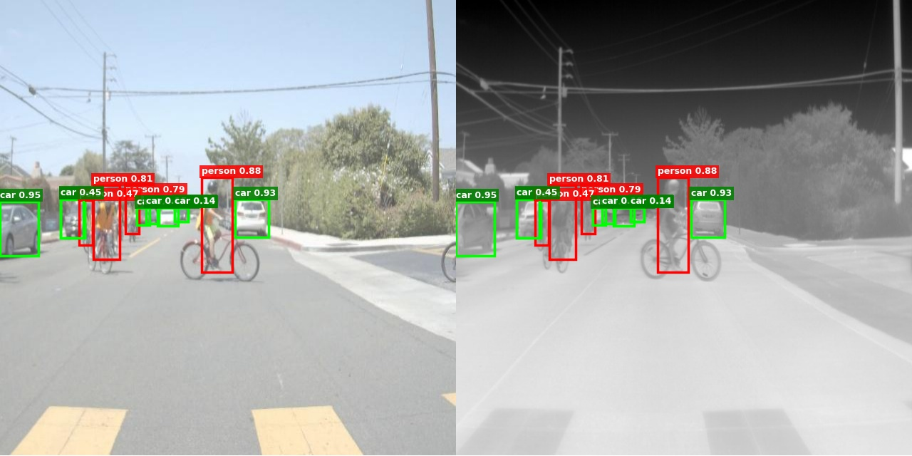
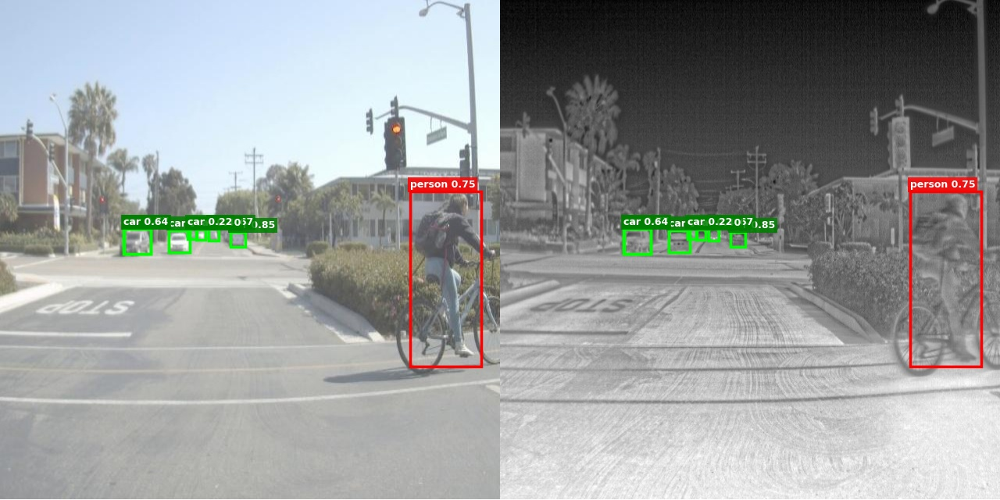
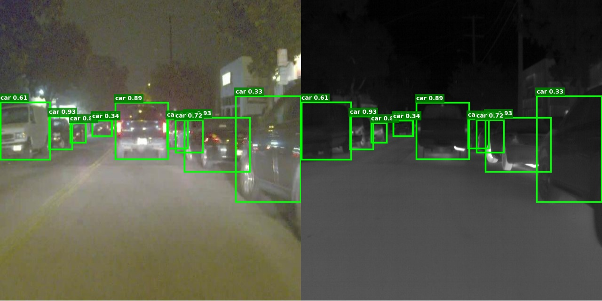
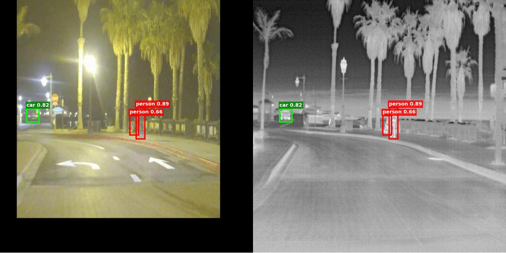
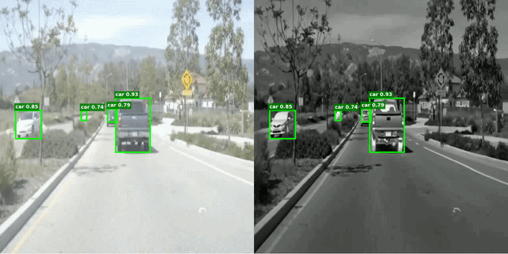

# RGBTYOLO: Dual-Input YOLO26 for RGB-Thermal Object Detection

<p align="center">
  <b>Dual-Input YOLO26 with P5 Cross-Modal Feature Fusion for RGB-Thermal Object Detection</b>
</p>

<p align="center">
  RGB + Thermal • P5 Feature Fusion • YOLO26 • FLIR ADAS • Person & Car Detection
</p>

---

## Overview

**RGBTYOLO** is a dual-input object detection framework designed for RGB-Thermal (RGB-T) perception.

The model processes synchronized **RGB** and **thermal** images using two independent YOLO26 feature extraction branches. High-level **P5 features** from both modalities are concatenated and projected using a `1×1` convolution before being passed to the YOLO26 detection neck and head.

The objective is to combine complementary information from both modalities:

- **RGB** provides appearance, texture, and color information.
- **Thermal** provides heat signatures and remains informative under challenging illumination.
- **P5 feature fusion** combines high-level semantic representations before detection.

The model is evaluated on the **FLIR ADAS RGB-Thermal dataset** for two object classes:

- `Person`
- `Car`

---

# Architecture

<p align="center">
  
</p>

```text
RGB input ──────> YOLO26 RGB Backbone ──────> P5 RGB ───────┐
                                                            │
                                                            ├─> Concat
                                                            │      │
Thermal input ──> YOLO26 Thermal Backbone ──> P5 Thermal────┘      │
                                                                   v
                                                          1×1 Conv (512→256)
                                                                   │
                                                                BN + SiLU
                                                                   │
                                                                   v
                                                          YOLO26 Neck + Head
                                                                   │
                                                                   v
                                                               Detections
```
The P5 fusion operation is:

```text
F_fused^P5 = Conv_1×1(Concat(F_RGB^P5, F_Thermal^P5))
```

In the implemented model:

```text
RGB P5      : 256 channels
Thermal P5  : 256 channels
Concat      : 512 channels
Projection  : 1×1 Conv, 512 → 256
Activation  : BatchNorm + SiLU
Output      : Fused P5 → YOLO26 Neck + Detection Head
```

The architecture implementation is available in:

```text
rgbtyolo/
├── architecture.py
└── fusion.py
```

---

# FLIR RGB-T Dataset

The model was trained and evaluated using paired RGB and thermal images from the **FLIR ADAS dataset**.

Each RGB image is associated with its corresponding thermal image using the same sample identifier. Thermal annotations are used as the reference detection labels.

## Dataset Structure

```text
DATA/
│
├── train/
│   ├── rgb/
│   │   ├── image_00001.jpg
│   │   └── ...
│   ├── thermal/
│   │   ├── image_00001.jpeg
│   │   └── ...
│   └── labels_thermal/
│       ├── image_00001.txt
│       └── ...
│
├── val/
│   ├── rgb/
│   ├── thermal/
│   └── labels_thermal/
│
└── test/
    ├── rgb/
    ├── thermal/
    └── labels_thermal/
```

A synchronized sample follows the same stem:

```text
rgb/image_00001.jpg
thermal/image_00001.jpeg
labels_thermal/image_00001.txt
```

## Annotation Format

Annotations use the standard YOLO format:

```text
class_id x_center y_center width height
```

Bounding-box coordinates are normalized to `[0, 1]`.

```python
CLASS_NAMES = {
    0: "Person",
    1: "Car",
}
```

---

# Dataset Distribution

<p align="center">
  
</p>

| Split | Person | Car |
|---|---:|---:|
| Train | 7,171 | 16,456 |
| Validation | 980 | 2,044 |
| Test | 836 | 2,108 |

The test set contains **414 paired RGB-Thermal images** and **2,944 ground-truth bounding boxes**.

---

# RGB-Thermal Preprocessing

RGB and thermal samples are loaded as synchronized pairs.

```text
RGB Image ──────────┐
                    ├── Pair by sample ID
Thermal Image ──────┘
          │
          ▼
Resize to 640 × 640
          │
          ▼
Tensor Conversion
          │
          ▼
Normalization
          │
          ▼
Dual YOLO26 Branches
```

Thermal images are converted to a 3-channel representation before being passed through the thermal YOLO26 branch. The same geometric transformation must be applied consistently to both modalities so their features remain spatially aligned.

---

# Training Strategy

Training is performed in two stages.

## Phase 1 — Fusion and Detection Adaptation

```text
RGB Backbone       → Frozen
Thermal Backbone   → Frozen
P5 Fusion          → Trainable
YOLO26 Neck        → Trainable
YOLO26 Head        → Trainable
```

```text
Maximum epochs : 30
Learning rate  : 1e-4
Weight decay   : 5e-4
Early stopping : enabled
Patience       : 10
```

## Phase 2 — End-to-End Fine-Tuning

```text
RGB Backbone       → Trainable
Thermal Backbone   → Trainable
P5 Fusion          → Trainable
YOLO26 Neck        → Trainable
YOLO26 Head        → Trainable
```

```text
Maximum epochs : 30
Learning rate  : 1e-5
Weight decay   : 5e-4
Early stopping : enabled
Patience       : 10
```

---

# Detection Loss

Training uses the native YOLO26 detection criterion through the adapter in:

```text
rgbtyolo/loss.py
```

This keeps the detection objective aligned with the YOLO26 detection head instead of maintaining a second custom loss implementation.

---

# Test Performance

<p align="center">
  
</p>

| Metric | Score |
|---|---:|
| **mAP@50** | **68.63%** |
| **mAP@50-95** | **35.58%** |
| **mAP@75** | **31.89%** |
| **mAR@100** | **52.52%** |
| Test Images | 414 |
| Ground-Truth Boxes | 2,944 |

---

# Per-Class Performance

<p align="center">
  
</p>

| Class | mAP@50-95 |
|---|---:|
| Person | 23.79% |
| Car | 47.37% |

---

# Qualitative Results

<table align="center">
  <tr>
    <td></td>
    <td></td>
  </tr>
  <tr>
    <td></td>
    <td></td>
  </tr>
  <tr>
    <td></td>
    <td></td>
  </tr>
</table>

---

# Video Demo

<p align="center">
  
</p>


---

# Installation

```bash
git clone https://github.com/Wassimhfaiedh/RGBTYOLO--Dual-Input-YOLO26-for-RGB-Thermal-Object-Detection.git
cd RGBTYOLO--Dual-Input-YOLO26-for-RGB-Thermal-Object-Detection
python -m venv .venv
```

Windows:

```bash
.venv\Scripts\activate
```

Linux/macOS:

```bash
source .venv/bin/activate
```

Install dependencies:

```bash
pip install -r requirements.txt
```

or:

```bash
pip install -e .
```

---

# Download Model Weights

The trained checkpoint is hosted separately because model weights are excluded from Git.

### Final RGBTYOLO P5 Fusion Model

**[Download `rgbtyolo_v1.pt` from Google Drive](https://drive.google.com/file/d/1ZxKg96OPuZzuJ24izw6-iBfCfLGSSDpf/view?usp=sharing)**

After downloading:

```text
RGBTYOLO/
└── weights/
    └── rgbtyolo_v1.pt
```

For architecture reconstruction/training:

```text
weights/
├── rgbtyolo_v1.pt
├── yolo26_rgb.pt
└── yolo26_thermal.pt
```

`rgbtyolo_v1.pt` is the final fused inference checkpoint. The RGB and thermal baseline checkpoints are used to construct/train the dual-input architecture.

---

# Image Inference

```python
from rgbtyolo import RGBTYOLO

model = RGBTYOLO(
    "weights/rgbtyolo_v1.pt",
    device="cpu",
)

result = model.predict(
    rgb="examples/rgb.jpg",
    thermal="examples/thermal.jpeg",
    conf=0.25,
)

print(result)
result.show()
result.save("runs/predictions/result.jpg")
```

Access predictions:

```python
print(result.boxes)
print(result.scores)
print(result.classes)
print(result.count)

for detection in result.summary():
    print(detection)
```

## Command Line

```bash
python scripts/predict_image.py \
    --weights weights/rgbtyolo_v1.pt \
    --rgb examples/rgb.jpg \
    --thermal examples/thermal.jpeg \
    --output runs/result.jpg \
    --conf 0.25
```

---

# Video Inference

```python
from rgbtyolo import RGBTYOLO

model = RGBTYOLO(
    "weights/rgbtyolo_v1.pt",
    device="cuda",
)

model.predict_video(
    rgb_video="videos/rgb.mp4",
    thermal_video="videos/thermal.mp4",
    output="runs/result.mp4",
    conf=0.25,
    display=False,
)
```

Set `display=True` for live visualization.

> RGB and thermal videos must correspond to the same scene and should be temporally synchronized.

## Command Line

```bash
python scripts/predict_video.py \
    --weights weights/rgbtyolo_v1.pt \
    --rgb videos/rgb.mp4 \
    --thermal videos/thermal.mp4 \
    --output runs/result.mp4 \
    --conf 0.25
```

---

# Building the Fusion Model

```python
from rgbtyolo import DualInputYOLO26

model = DualInputYOLO26.from_ultralytics(
    rgb_weights="weights/yolo26_rgb.pt",
    thermal_weights="weights/yolo26_thermal.pt",
    p5_channels=256,
)
```

Model structure:

```text
DualInputYOLO26
│
├── rgb_backbone
├── thermal_backbone
├── fusion_p5
│   └── P5ConcatFusion
│       ├── Concat
│       ├── Conv2d(512 → 256, 1×1)
│       ├── BatchNorm2d
│       └── SiLU
└── neck_head
```

---

# Project Structure

```text
RGBTYOLO/
│
├── rgbtyolo/
│   ├── __init__.py
│   ├── architecture.py
│   ├── fusion.py
│   ├── loss.py
│   ├── model.py
│   ├── predictor.py
│   ├── preprocessing.py
│   ├── results.py
│   ├── training.py
│   ├── weights.py
│   └── constants.py
│
├── scripts/
│   ├── predict_image.py
│   ├── predict_video.py
│   └── train.py
│
├── assets/
│   ├── architecture.png
│   ├── demo.gif
│   ├── evaluation/
│   │   ├── test_performance.png
│   │   ├── per_class_map.png
│   │   └── class_distribution.png
│   └── results/
│       ├── result_01.jpg
│       ├── result_02.jpg
│       ├── result_03.jpg
│       ├── result_04.jpg
│       ├── result_05.jpg
│       └── result_06.jpg
│
├── examples/
├── weights/
├── ARCHITECTURE.md
├── app.py
├── requirements.txt
├── pyproject.toml
├── .gitignore
└── README.md
```

---
## Citation

```bibtex
@software{rgbtyolo2026,
  title = {RGBTYOLO: Dual-Input YOLO26 with P5 Cross-Modal Feature Fusion for RGB-Thermal Object Detection},
  year  = {2026},
  url   = {https://github.com/Wassimhfaiedh/RGBTYOLO--Dual-Input-YOLO26-for-RGB-Thermal-Object-Detection.git}
}
```

---

<p align="center">
  <b>RGBTYOLO — RGB-Thermal Object Detection with YOLO26 P5 Feature Fusion</b>
</p>
